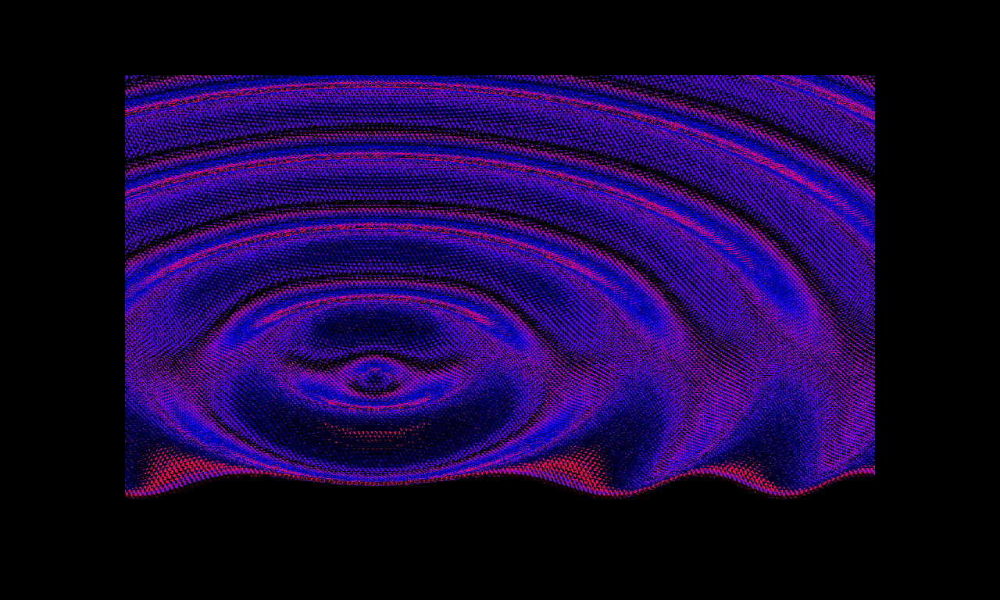

# Fragment Shader Experiment

## Installation
1. Download OpenFrameworks from their [website's download page](https://openframeworks.cc/download/)
2. Install Xcode and the Xcode command line tools, [here's a setup guide](https://openframeworks.cc/setup/xcode/).
3. Choose a folder to setup your openFrameworks library and create a new project, [here's a guide](https://openframeworks.cc/learning/01_basics/create_a_new_project/).
4. Navigate to your new project (`openFrameworks/apps/myApps/nameOfYourApp`), your app folder should have a couple of files and folders, including a `src` and `bin` folder. 
5. Replace the `src` folder with the one from this repository.
6. Place `bin/data` inside your `bin` folder. 
7. Open `nameOfYourApp.xcodeproj` with Xcode.
8. Compile and Run (`cmd` + `R`).
9. Take a screenshot with `x`. The screenshot can be found in `bin/data` as `screenshot.png`.

